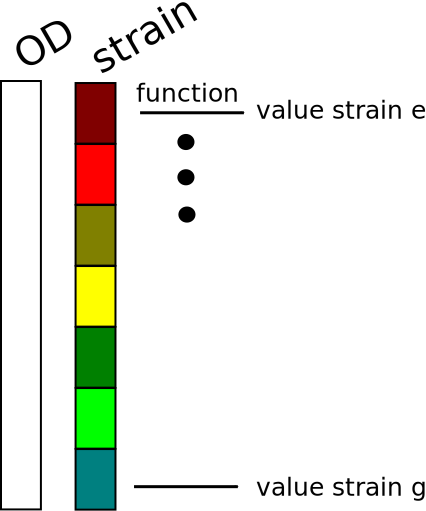
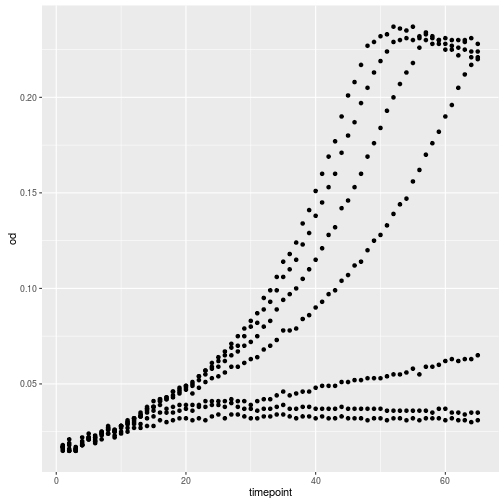
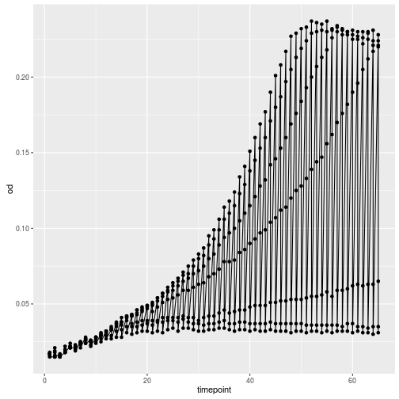
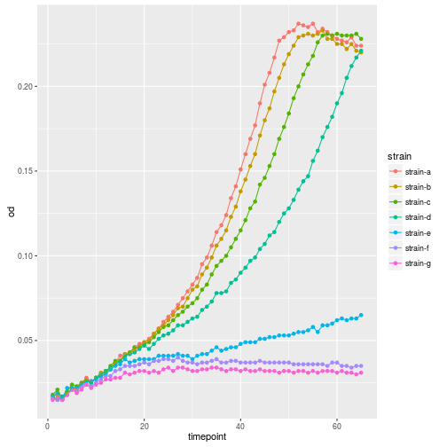
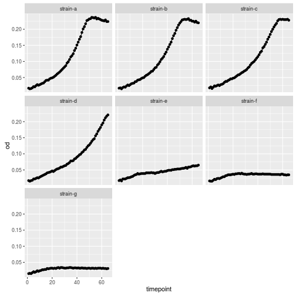

## What is R?

R is a statistical computing environment that has become a widely adopted standard for data analysis various fields - notably bioinformatics.

- R is a dialect of the old (commercial) S language
- R is relatively easy to learn to use - tons of built-in functions
  that are just right for data analysis, focused on interactive use
  and often very high-level
- There are thousands of package implementing algorithms, procedures,
  plots - for life science in particular
- R is also a programming language. But not a great one.

Consider using R to get access to packages that implement solution to a given problems like

- differential gene expression analysis, gene set enrichment analysis,
- metabolomics data analysis,
- gene clustering,
- access to online databases on gene expression / annotation etc,
- qRT-PCR,
- multivariate statistics, mixed linear models,
- and much much more..

*With Python, we have the framework to write great software for data analysis - with R, that software is, for better or worse, often already written*

## RStudio - a graphical interface to R

While R can be used directly in the shell, it is much nicer with a graphical interface. RStudio is by far the best one - let's learn how to use it.

* Point to the different panels: Console, Scripts, Environments, Plots.
* Code and workflow are more reproducible if we can document everything that we do.
* Our end goal is not just to "do stuff" but to do it in a way that anyone can
  easily and exactly replicate our workflow and results.
* The best way to achieve this is to write scripts. RStudio provides an
  environment that allows you to do that.

### Interacting with R

There are two main ways of interacting with R: using the console or by using
script files (plain text files that contain your code).

The console window (in RStudio, the bottom left panel) is the place where R is
waiting for you to tell it what to do, and where it will show the results of a
command.  You can type commands directly into the console, but they will be
forgotten when you close the session. It is better to enter the commands in the
script editor, and save the script. This way, you have a complete record of what
you did, you can easily show others how you did it and you can do it again later
on if needed. You can copy-paste into the R console, but the Rstudio script
editor allows you to 'send' the current line or the currently selected text to
the R console using the `Ctrl-Enter` shortcut.

At some point in your analysis you may want to check the content of variable or
the structure of an object, without necessarily keep a record of it in your
script. You can type these commands directly in the console. RStudio provides
the `Ctrl-1` and `Ctrl-2` shortcuts allow you to jump between the script and the
console windows.

If R is ready to accept commands, the R console shows a `>` prompt. If it
receives a command (by typing, copy-pasting or sent from the script editor using
`Ctrl-Enter`), R will try to execute it, and when ready, show the results and
come back with a new `>`-prompt to wait for new commands.

If R is still waiting for you to enter more data because it isn't complete yet,
the console will show a `+` prompt. It means that you haven't finished entering
a complete command. This is because you have not 'closed' a parenthesis or
quotation. If you're in RStudio and this happens, click inside the console
window and press `Esc`; this should help you out of trouble.

## Basic R syntax
### R as a calculator and variable assignment

Just like with python, we can perform simple operations using the R console and assign the output to variables

~~~
1 + 1
~~~
{: .r}

~~~
[1] 2
~~~
{: .output}

`<-` is the assignment operator. It assigns values on the right to objects on
the left. So, after executing `x <- 3`, the value of `x` is `3`. The arrow can
be read as 3 **goes into** `x`.  You can also use `=` for assignments but not in
all contexts so it is good practice to use `<-` for assignments. `=` should only
be used to specify the values of arguments in functions, see below.

> ## Save some keystrokes..
> In RStudio, typing `Alt + -` (push `Alt`, the key next to your space bar at the
> same time as the `-` key) will write ` <- ` in a single keystroke.
{: .callout}

~~~
foo <- 1 + 1
foo + 1
~~~
{: .r}

~~~
[1] 3
~~~
{: .output}

> ## Commenting
>
> We can add comments to our code using the `#` character. It is
> useful to document our code in this way so that others (and us the
> next time we read it) have an easier time following what the code is
> doing.
{: .callout}

We can create some random numbers from the normal distribution and calculate the mean by using two built-in functions

~~~
randomNumbers <- rnorm(10)
mean(randomNumbers)
~~~
{: .r}

~~~
[1] 0.101893
~~~
{: .output}

> ## All those built-ins..
>
> In contrast to Python, R has many functions available without
> loading any extra packages (2383 to be exact). These are mostly
> functions and becoming proficient with R is a lot about learning how
> these work.
{: .callout}

### Getting help

All R functions are documented and you can read about them using RStudio documentation pane, or typing `?object`, eg

~~~
?mean
~~~
{: .r}
### R data types
R has three main data types that we need to know about, the two main ones are `numeric` which is both integers and floats, `character`, and `factor` which is like integer but with a character label attached to number (or `level`). 

~~~
is.numeric(1)
~~~
{: .r}

~~~
[1] TRUE
~~~
{: .output}

~~~
is.character("foo")
~~~
{: .r}

~~~
[1] TRUE
~~~
{: .output}

~~~
is.factor(factor(c("a", "b", "c", "c")))
~~~
{: .r}

~~~
[1] TRUE
~~~
{: .output}

There are numerous data structures and classes but mainly three we need to care about.

**Vectors** Scalars act like vectors of length 1.

~~~
foo <- c(1, 2, 3)
foo[2]
~~~
{: .r}

~~~
[1] 2
~~~
{: .output}

~~~
bar <- 1
bar[1]
~~~
{: .r}

~~~
[1] 1
~~~
{: .output}

> ## Indexing starts at 1!
>
> Unlike python (and indeed most other programming languages) indexing starts at 1. `bar[0]` is however still syntactic correct, it just selects the null-vector from vector `bar` thus always a vector of length 0.
{: .callout}

**Matrices** work like one would expect, values in two dimensions. 

~~~
(foo <- matrix(c(1, 2, 3, 4, 5, 6), nrow=2))
~~~
{: .r}

~~~
     [,1] [,2] [,3]
[1,]    1    3    5
[2,]    2    4    6
~~~
{: .output}

**Lists** are widely used and work like vectors except that each element can be any data structure - so you can have lists of matrices, lists of lists etc.

~~~
(foo <- list(bar=c(1, 2, 3), baz=matrix(c(1, 2, 3, 4, 5, 6), nrow=2)))
~~~
{: .r}

~~~
$bar
[1] 1 2 3

$baz
     [,1] [,2] [,3]
[1,]    1    3    5
[2,]    2    4    6
~~~
{: .output}

~~~
foo[[2]]
~~~
{: .r}

~~~
     [,1] [,2] [,3]
[1,]    1    3    5
[2,]    2    4    6
~~~
{: .output}

~~~
foo$baz
~~~
{: .r}

~~~
     [,1] [,2] [,3]
[1,]    1    3    5
[2,]    2    4    6
~~~
{: .output}

Finally, **data frames** but they are so important they deserve a small section on their own.

## Read data into R

Now that we know how to assign things to variables and use functions, let's read some yeast OD growth data into R using `read.table` and briefly examine the dataset.
 

~~~
growth <- read.table(file = "data/yeast-growth.csv", header = TRUE, sep = ",")
~~~
{: .r}

> ## Loading Data Without Headers
>
> What happens if you put `header = FALSE`? The default value is `header = TRUE`?. What do you expect will happen if you leave the default value? Before you run any code, think about what will happen to the first few rows of your data frame, and its overall size. Then run the following code and see if your expectations agree:
>
> ~~~
> head(read.table(file = "data/yeast-growth.csv", header = FALSE, sep = ","))
> ~~~
> {: .r}
{: .challenge}

> ## Where is that file? Or, what is my working directory?
>
> R is always running inside a specific directory, the *working
> directory*. Paths can be given relative to that directory so with
> `data/yeast-growth.csv` we mean 'the file `yeast-growth.csv` in the
> `data` directory that is right at the working directory. Set the
> working directory using RStudio `Session` > `Set Working Directory..` or `setwd()`
{: .callout}

## Working with data frames

Now that our data is loaded in memory, we can start doing things with it.
First, let's ask what type of thing `growth` is:

~~~
head(growth)
~~~
{: .r}

~~~
     V3   strain timepoint    od medium
1 1e-02 strain-a         1 0.017    low
2 3e-02 strain-b         1 0.017    low
3 1e+00 strain-c         1 0.018 medium
4 3e+00 strain-d         1 0.017 medium
5 3e+01 strain-e         1 0.017 medium
6 1e+02 strain-f         1 0.016   high
~~~
{: .output}

~~~
str(growth) # what data types are the different columns?
~~~
{: .r}

~~~
'data.frame':	455 obs. of  5 variables:
 $ V3       : num  1e-02 3e-02 1e+00 3e+00 3e+01 1e+02 3e+02 1e-02 3e-02 1e+00 ...
 $ strain   : Factor w/ 7 levels "strain-a","strain-b",..: 1 2 3 4 5 6 7 1 2 3 ...
 $ timepoint: int  1 1 1 1 1 1 1 2 2 2 ...
 $ od       : num  0.017 0.017 0.018 0.017 0.017 0.016 0.015 0.015 0.018 0.021 ...
 $ medium   : Factor w/ 3 levels "high","low","medium": 2 2 3 3 3 1 1 2 2 3 ...
~~~
{: .output}

~~~
class(growth)
~~~
{: .r}

~~~
[1] "data.frame"
~~~
{: .output}

The output tells us that is a data frame. Think of this structure as a spreadsheet in MS Excel that many of us are familiar with.
Data frames are very useful for storing data and you will find them elsewhere when programming in R. A typical data frame of experimental data contains individual observations in rows and variables in columns.

We can see the shape, or [dimensions]({{ site.github.url }}/reference/#dimensions), of the data frame with the function `dim`:

~~~
dim(growth)
~~~
{: .r}

~~~
[1] 455   5
~~~
{: .output}

This tells us that our data frame, `growth`, has 455 rows and 5 columns.

If we want to get a single value from the data frame, we can provide an [index]({{ site.github.url }}/reference/#index) in square brackets, just as we do in math:

~~~
 # first value in dat
growth[1, 1]
~~~
{: .r}

~~~
[1] 0.01
~~~
{: .output}

~~~
 # middle value in dat
growth[30, 2]
~~~
{: .r}

~~~
[1] strain-b
7 Levels: strain-a strain-b strain-c strain-d strain-e ... strain-g
~~~
{: .output}

An index like `[30, 2]` selects a single element of a data frame, but we can select whole sections as well.
For example, we can select the first ten days (columns) of values for the first four patients (rows) like this:

~~~
growth[1:4, 1:2]
~~~
{: .r}

~~~
    V3   strain
1 0.01 strain-a
2 0.03 strain-b
3 1.00 strain-c
4 3.00 strain-d
~~~
{: .output}

The [slice]({{ site.github.url }}/reference/#slice) `1:4` means, "Values from 1 to 4."

We can use the function `c`, which stands for **c**oncatenate, to select non-contiguous values:

~~~
growth[c(3, 8, 37, 56), c(1, 3)]
~~~
{: .r}

~~~
      V3 timepoint
3  1e+00         1
8  1e-02         2
37 3e-02         6
56 3e+02         8
~~~
{: .output}

We also don't have to provide a slice for either the rows or the columns.
If we don't include a slice for the rows, R returns all the rows; if we don't include a slice for the columns, R returns all the columns.
If we don't provide a slice for either rows or columns, e.g. `growth[, ]`, R returns the full data frame.

~~~
growth[5, ]
~~~
{: .r}

~~~
  V3   strain timepoint    od medium
5 30 strain-e         1 0.017 medium
~~~
{: .output}

> ## Addressing Columns by Name (the better way)
>
> Columns can also be addressed by name, with either the `$` operator (ie. `growth$medium`) or square brackets (ie. `growth[,"medium"]`).
> You can learn more about subsetting by column name in this supplementary [lesson]({{ site.github.url }}/10-supp-addressing-data/).
{: .callout}

Particularly useful is also to user other vectors as filters and only return the rows that evaluate to `TRUE`. Here, `growth$strain == "strain-e"` gives a vector with `TRUE` or `FALSE` for every element in `growth$strain` that is equal to `"strain-e"`.

~~~
head(growth[growth$strain == "strain-e",])
~~~
{: .r}

~~~
   V3   strain timepoint    od medium
5  30 strain-e         1 0.017 medium
12 30 strain-e         2 0.019 medium
19 30 strain-e         3 0.016 medium
26 30 strain-e         4 0.022 medium
33 30 strain-e         5 0.022 medium
40 30 strain-e         6 0.022 medium
~~~
{: .output}

Now let's perform some common mathematical operations to learn about our growth curves.

~~~
max(growth[growth$strain == "strain-e", "od"])
~~~
{: .r}

~~~
[1] 0.065
~~~
{: .output}

R also has functions for other common calculations, e.g. finding the minimum, mean, and standard deviation of the data:

~~~
min(growth[growth$strain == "strain-e", "od"])
~~~
{: .r}

~~~
[1] 0.016
~~~
{: .output}

~~~
mean(growth[growth$strain == "strain-e", "od"])
~~~
{: .r}

~~~
[1] 0.04347692
~~~
{: .output}

~~~
sd(growth[growth$strain == "strain-e", "od"])
~~~
{: .r}

~~~
[1] 0.01259974
~~~
{: .output}

We may want to compare the different strains and for that we can use the split-apply approach which is very common in R. One (out of many) functions in R that implements this is `tapply`

~~~
tapply(growth$od, growth$strain, max)
~~~
{: .r}

~~~
strain-a strain-b strain-c strain-d strain-e strain-f strain-g 
   0.237    0.233    0.231    0.221    0.065    0.040    0.034 
~~~
{: .output}

There are many more `apply` style functions among which `lapply` for applying functions of to elements of lists, `apply` for applying functions to rows or columns of a matrix. 

> ## Other forms of apply
>
> `split` is a function that can turn an array to a list based on another variable that indicates the groups, e.g. our 'strains'. Read a bit about `split` then use it together with `lapply` to achieve the same result as `tapply(growth$od, growth$strain, max)`
{: .challenge}

## Installing a package
Next we will plot our data but since the default graphics system in R is quite cumbersome to use, and there is a very popular both easy to use and the same time very flexible package for making beautiful plots, we will use that instead - `ggplot2`. Since `ggplot2` isn't included with R by default, we first have to install it. 

Install in RStudio by the menu system or type

~~~
install.packages("ggplot2")
~~~
{: .r}

This will also install a number of packages that `ggplot2` depends on. Once done, load the package from the library by

~~~
library(ggplot2)
~~~
{: .r}

## Plotting our data

`ggplot2` works well with data frames, particularly when formatted in the 'long' format that our growth data is already in. Plots are initialized with the `ggplot()` function and then we add layers to it to represent the data. Let's first make a simple scatter plot.

~~~
ggplot(growth, aes(x=timepoint, y=od)) +
    geom_point()
~~~
{: .r}

Let's add another layer, a line this time.

~~~
ggplot(growth, aes(x=timepoint, y=od)) +
    geom_point() +
    geom_line()
~~~
{: .r}

Oops, that looks funny. Why? Because we haven't informed ggplot about the strains that each should make up a trajectory in our plot. We can do that by simply adding strain as another aesthetic. 

~~~
ggplot(growth, aes(x=timepoint, y=od, color=strain)) +
    geom_point() +
    geom_line()
~~~
{: .r}

Plotting each line in separat facet would have been another option

~~~
ggplot(growth, aes(x=timepoint, y=od)) +
    geom_point() +
    geom_line() +
    facet_wrap(~strain)
~~~
{: .r}

`ggplot2` can present data in a large number of ways, explore the
[online documentation](http://docs.ggplot2.org) or the
[R graph gallery](http://www.r-graph-gallery.com/portfolio/ggplot2-package/)
for inspiration.
