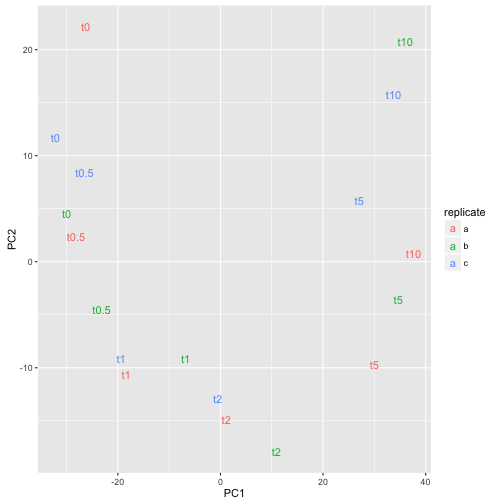

von Wulffen et al has deposited a [RNA-seq expression dataset](http://www.ncbi.nlm.nih.gov/geo/query/acc.cgi?acc=GSE71562) from studying the effects on *E. coli* transitioning from anaerobic conditions to aerobic conditions. Three biological replicate cultures where grown in anaerobic conditions, sampled, then subjected to aeration at 1 l/min and new samples were taken after 0.5, 1, 2, 5 and 10   min. Total RNA was extracted from the samples, ribo-depleted and sequenced on Illumina HISeq. Reads were aligned to K12 reference genome and counted for each gene. 

That data has been downloaded here and we will here use it to provide an example of how to perform a introductory analysis using the edgeR package. We will

- read the data to R
- perform a PCA (principal component analysis) to get an
  overview of how dissimilar the samples are
- find genes that are up/down regulated upon aeration
- figure out which biological processes are affected mostly

## Install the required packages

We will make use of the Bioconductor `edgeR` package as well as the `org.EcK12.eg.db` package so we start by downloading and installing those.

~~~
source("https://bioconductor.org/biocLite.R")
biocLite(c("edgeR", "org.EcK12.eg.db"))
install.packages("locfit")
~~~
{: .r}

Then load the required packages.

~~~
library(edgeR)
~~~
{: .r}

~~~
Loading required package: limma
~~~
{: .output}

~~~
library(ggplot2)
library(org.EcK12.eg.db)
~~~
{: .r}

~~~
Loading required package: AnnotationDbi
~~~
{: .output}

~~~
Loading required package: stats4
~~~
{: .output}

~~~
Loading required package: BiocGenerics
~~~
{: .output}

~~~
Loading required package: parallel
~~~
{: .output}

~~~

Attaching package: 'BiocGenerics'
~~~
{: .output}

~~~
The following objects are masked from 'package:parallel':

    clusterApply, clusterApplyLB, clusterCall, clusterEvalQ,
    clusterExport, clusterMap, parApply, parCapply, parLapply,
    parLapplyLB, parRapply, parSapply, parSapplyLB
~~~
{: .output}

~~~
The following object is masked from 'package:limma':

    plotMA
~~~
{: .output}

~~~
The following objects are masked from 'package:stats':

    IQR, mad, xtabs
~~~
{: .output}

~~~
The following objects are masked from 'package:base':

    Filter, Find, Map, Position, Reduce, anyDuplicated, append,
    as.data.frame, cbind, colnames, do.call, duplicated, eval,
    evalq, get, grep, grepl, intersect, is.unsorted, lapply,
    lengths, mapply, match, mget, order, paste, pmax, pmax.int,
    pmin, pmin.int, rank, rbind, rownames, sapply, setdiff, sort,
    table, tapply, union, unique, unsplit
~~~
{: .output}

~~~
Loading required package: Biobase
~~~
{: .output}

~~~
Welcome to Bioconductor

    Vignettes contain introductory material; view with
    'browseVignettes()'. To cite Bioconductor, see
    'citation("Biobase")', and for packages 'citation("pkgname")'.
~~~
{: .output}

~~~
Loading required package: IRanges
~~~
{: .output}

~~~
Loading required package: S4Vectors
~~~
{: .output}

~~~

Attaching package: 'S4Vectors'
~~~
{: .output}

~~~
The following objects are masked from 'package:base':

    colMeans, colSums, expand.grid, rowMeans, rowSums
~~~
{: .output}

~~~

~~~
{: .output}

`edgeR` comes with very good user manual. You can access it by

~~~
edgeRUsersGuide()
~~~
{: .r}

> ## Vignettes often provide great introduction to packages
> `edgeR` provides a special function to open the vignette, other packages use the `vignette(topic, package)` function. See which vignettes are available for e.g. ggplot2!
{: .callout}

## Read the data

The read-counts data is simply a table and we already know how to read those.

~~~
wulffenTable <- read.table("data/GSE71562.csv", header = TRUE, row.names = 1, sep = ",")
head(wulffenTable)
~~~
{: .r}

~~~
     E14R012a01 E14R012a02 E14R012a03 E14R012a04 E14R012a05 E14R012a06
aaeA        100         56         44         94         32         38
aaeB        116         47         54         80         37         43
aaeR        316        253        249        396        181        176
aaeX         77         53         53         86         46         37
aas         407        286        283        375        188        169
aat         243        169        163        252        104        169
     E14R012b01 E14R012b02 E14R012b03 E14R012b04 E14R012b05 E14R012b06
aaeA         55         41         74         89         88        101
aaeB         54         31         72         75         69        123
aaeR        220        164        277        363        400        333
aaeX         68         35         70         85         96         91
aas         265        189        380        362        399        427
aat         104        116        219        263        232        300
     E14R012c01 E14R012c02 E14R012c03 E14R012c04 E14R012c05 E14R012c06
aaeA         29        109        132         90         50         66
aaeB         22        101        104         88         58         81
aaeR        117        381        521        393        194        213
aaeX         52         76        134        132         45         58
aas         128        471        614        470        208        283
aat          68        233        348        237        123        202
~~~
{: .output}

Genes in rows, samples in columns. 

We also need to know which sample is which is which and there is a different file that contains that information.

~~~
samples <- read.table("data/pheno.csv", header = TRUE, row.names = 1, sep = ",")
samples
~~~
{: .r}

~~~
           replicate time
E14R012a01         a   t0
E14R012a02         a t0.5
E14R012a03         a   t1
E14R012a04         a   t2
E14R012a05         a   t5
E14R012a06         a  t10
E14R012b01         b   t0
E14R012b02         b t0.5
E14R012b03         b   t1
E14R012b04         b   t2
E14R012b05         b   t5
E14R012b06         b  t10
E14R012c01         c   t0
E14R012c02         c t0.5
E14R012c03         c   t1
E14R012c04         c   t2
E14R012c05         c   t5
E14R012c06         c  t10
~~~
{: .output}

We then create a `DGEList` which is a class used by `edgeR` and calculate normalization factor for each library (to make sure we don't overestimate expression of genes that come from samples that were sequenced deeper).

~~~
wulffen <- DGEList(counts=wulffenTable, genes=rownames(wulffenTable),
                   samples=samples)
wulffen <- calcNormFactors(wulffen)
~~~
{: .r}

## Exploring the data

An often very useful way to explore large datasets is to perform a PCA and plot the samples in 2D that maximally capture the variation in the dataset. This must be done on a statistic for each gene that is independent on the length of the gene so for this purpose we calculate get the 'counts per million' matrix.

~~~
wulffenCpm <- cpm(wulffen)
~~~
{: .r}

Then we perform PCA using the built-in R function `prcomp`.

~~~
scores <- prcomp(log2(t(wulffenCpm) + 0.25))$x
~~~
{: .r}

> ## What did the `t` do? Why `+ 0.25`?
>
> `prcomp` requires the `variables` in this case the genes, to come in
> the rows so we used `t` to transpose the data matrix. Since we know
> gene expression values tend to follow log-normal distributions, we
> use `log2` to transform the data. Why did we add the magic value
> `0.25`? Try removing it and see what you get.
> {: .r}
{: .challenge}

To get a nice data frame that we can use for plotting we simply use `merge` with the samples data fram.

~~~
pcaDf <- merge(scores, samples, by=0)
~~~
{: .r}

Then we can plot the data using `ggplot2`

~~~
ggplot(pcaDf, aes(PC1, PC2, label=time, color=replicate)) +
    geom_text()
~~~
{: .r}

The time-series can easily be recognized which is a good sign that experiment was successful.

## Differentially expressed genes

From our PCA we could, as expected, see that the las timepoint is the most dissimilar from the the anaerobic condition. Let's make a comparison between the anaerobic and 10 min anearobic samples and see which genes are differentially expressed between those.

With `edgeR` we will fit a simple generalized linear model to get estimates for differential expression and for that we first need to create a *design matrix* that accurately describes the comparison we are after.

~~~
wulffenShort <- wulffen[, wulffen$samples$time %in% c("t0", "t10")]
design <- model.matrix(~as.character(time), data=wulffenShort$samples)
colnames(design) <- c("(Intercept)", "t10")
design
~~~
{: .r}

~~~
           (Intercept) t10
E14R012a01           1   0
E14R012a06           1   1
E14R012b01           1   0
E14R012b06           1   1
E14R012c01           1   0
E14R012c06           1   1
attr(,"assign")
[1] 0 1
attr(,"contrasts")
attr(,"contrasts")$`as.character(time)`
[1] "contr.treatment"
~~~
{: .output}

The matrix we just created indicates which samples should be used to calculate the intercept (all samples) and then the effect of 10 min aeration (the t10 samples). With these objects we can now perform our differential expression analysis. 

~~~
wulffenShort <- estimateDisp(wulffenShort, design)
fit <- glmFit(wulffenShort, design)
lrt <- glmLRT(fit)
topTags(lrt)
~~~
{: .r}

~~~
Coefficient:  t10 
     genes    logFC   logCPM       LR        PValue           FDR
1464   mqo 5.983158 8.274567 501.8363 3.788200e-111 1.636124e-107
411   cyoA 7.245625 9.872659 457.2736 1.884543e-101  4.069670e-98
2240  sodA 7.363860 9.419456 444.0240  1.441070e-98  2.074661e-95
1735  phoH 5.249415 6.500320 409.3635  5.042966e-91  5.445142e-88
413   cyoC 6.132766 8.098590 401.6896  2.361164e-89  2.039573e-86
415   cyoE 5.368196 8.313842 400.1644  5.071640e-89  3.650736e-86
1867  puuD 4.451530 6.908350 383.1221  2.601531e-85  1.605145e-82
674   fhuF 6.378675 7.996506 374.5202  1.940986e-83  1.047890e-80
1186  iscR 4.453203 9.513508 369.7437  2.128146e-82  1.021274e-79
227   betT 4.818173 8.357982 361.3547  1.427579e-80  6.165712e-78
~~~
{: .output}

What did we just do? The `estimateDisp` function is needed to estimate variance components robustly, `glmFit` fits the model we are after that essentially has one overall mean of expression and another mean for the t10 samples. glmLRT performes a log-likelihood ratio test against the null-hypothesis that t10 has the same average as all the samples together. Then with `topTags` we extract a table with the 10 most differentially expressed genes.

> ## Write the expression estimates to a file
>
> It is often useful to export the data for use in other programs and sharing with colleagues. Use the `write.table` function to export a comma separated file with the output of `topTags` for all genes.
> {: .r}
{: .challenge}

> ## Extra challenge: identifier mappings
>
> Use the `merge` function and the mapping to bnumbers in `data/ecoli.csv` to also add a column with bnumbers as identifiers
> {: .r}
{: .challenge}

## Over-representation analysis of biological processes

We want to examine if the top differentially expressed genes have any particular biological processes in common. We will do this using the function `goana` from the `limma` package. The input to `goana` must be Entrez identifiers so we first need to map our gene symbols to Entrez. Bioconductor conveniently provides this mapping so all we need to do is to load the right annotation package and map our identifiers. We also define an object `universe` which holds all the genes which were present in our dataset, and which could be mapped to Entrez identifiers - that is simply all our mapped genes except the missing values (na = not available).

~~~
library(org.EcK12.eg.db)
symbol2entrez <- mapIds(org.EcK12.eg.db, rownames(lrt), "ENTREZID", keytype="SYMBOL")
~~~
{: .r}

~~~
'select()' returned 1:many mapping between keys and columns
~~~
{: .output}

~~~
universe <- na.omit(symbol2entrez)
~~~
{: .r}

Then, we get a list of differentially expresssed genes, which we define as having a false discovery rate below 0.05. 

~~~
fdr <- p.adjust(lrt$table[,"PValue"], "fdr")
allSymbols <- rownames(lrt$table)
deSymbols <- allSymbols[fdr < 0.05 & !is.na(symbol2entrez)]
deEntrez <- symbol2entrez[deSymbols]
~~~
{: .r}

We perform the GO over-representation analyis using `goana`. We define the species to enable `goana` figure out the mapping between Entrez identifiers go GO terms.

~~~
goTable <- goana(deEntrez, universe=universe, species="EcK12")
head(goTable[order(goTable$P.DE),])
~~~
{: .r}

~~~
                                                          Term Ont   N  DE
GO:0006091      generation of precursor metabolites and energy  BP 196 140
GO:0015980 energy derivation by oxidation of organic compounds  BP 185 133
GO:0045333                                cellular respiration  BP 168 121
GO:0055114                         oxidation-reduction process  BP 213 140
GO:0009061                               anaerobic respiration  BP 140 100
GO:0009060                                 aerobic respiration  BP  65  55
                   P.DE
GO:0006091 2.367795e-45
GO:0015980 1.912235e-43
GO:0045333 2.009595e-39
GO:0055114 1.290043e-38
GO:0009061 8.139077e-32
GO:0009060 6.101281e-24
~~~
{: .output}

